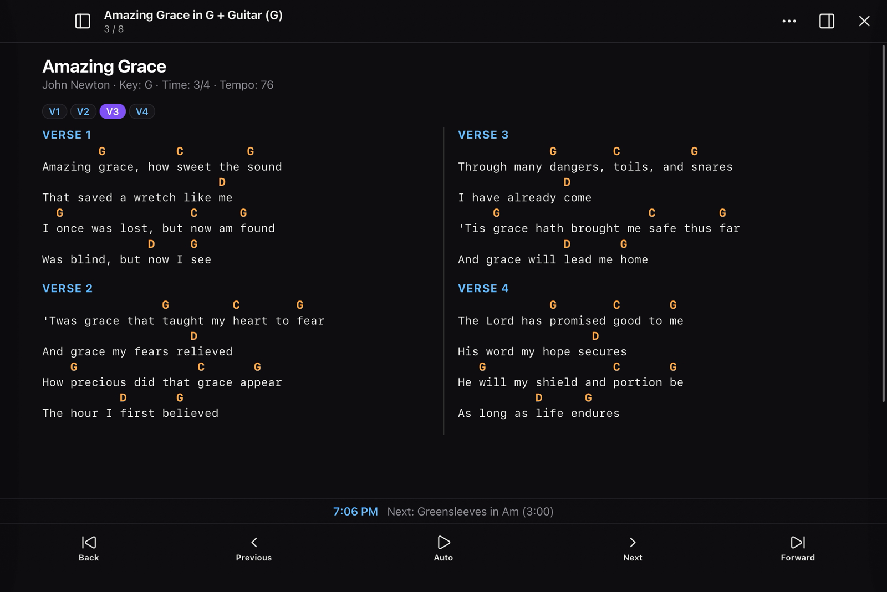
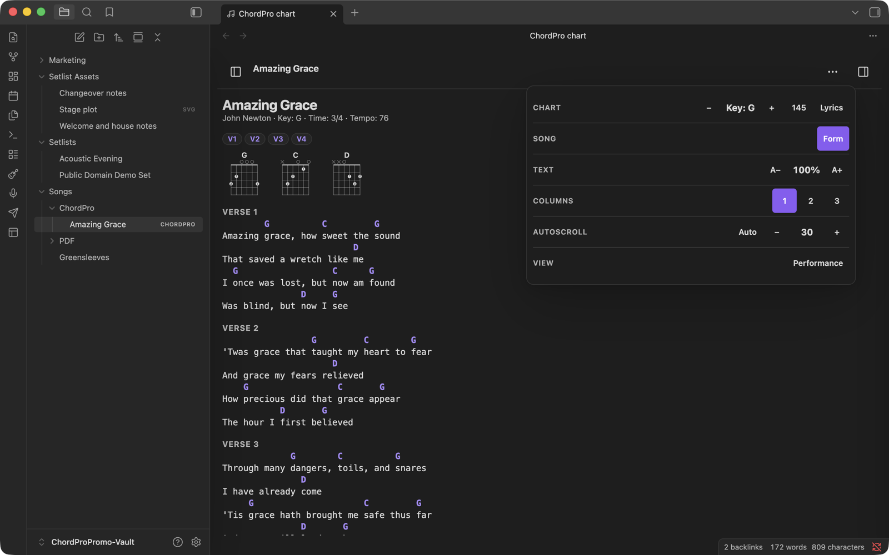
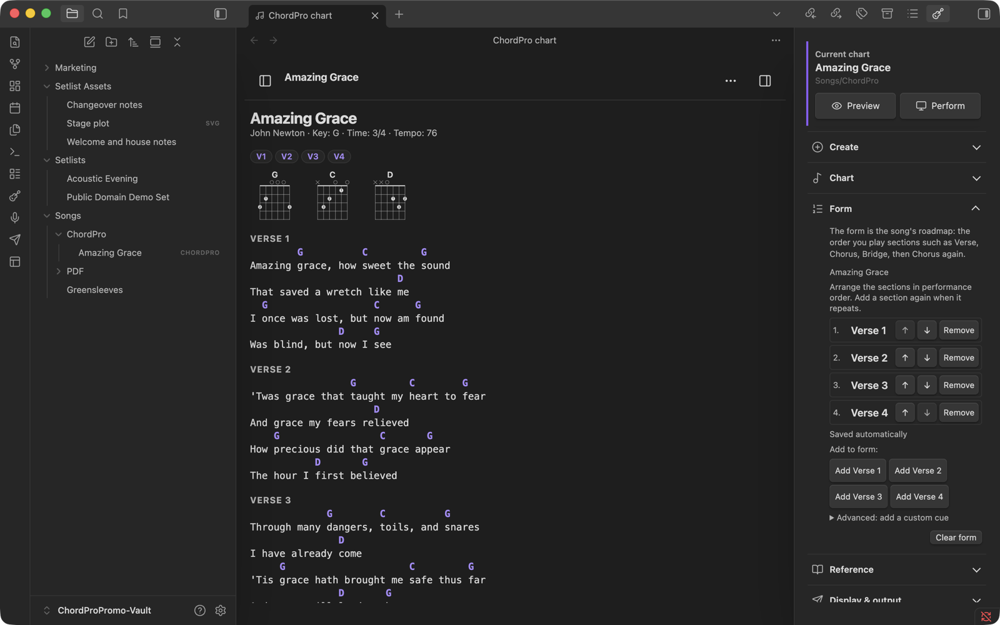
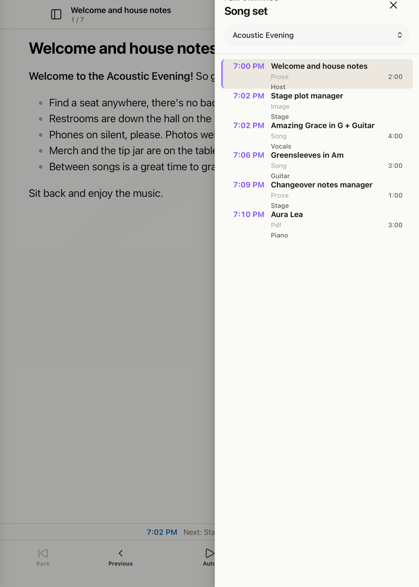
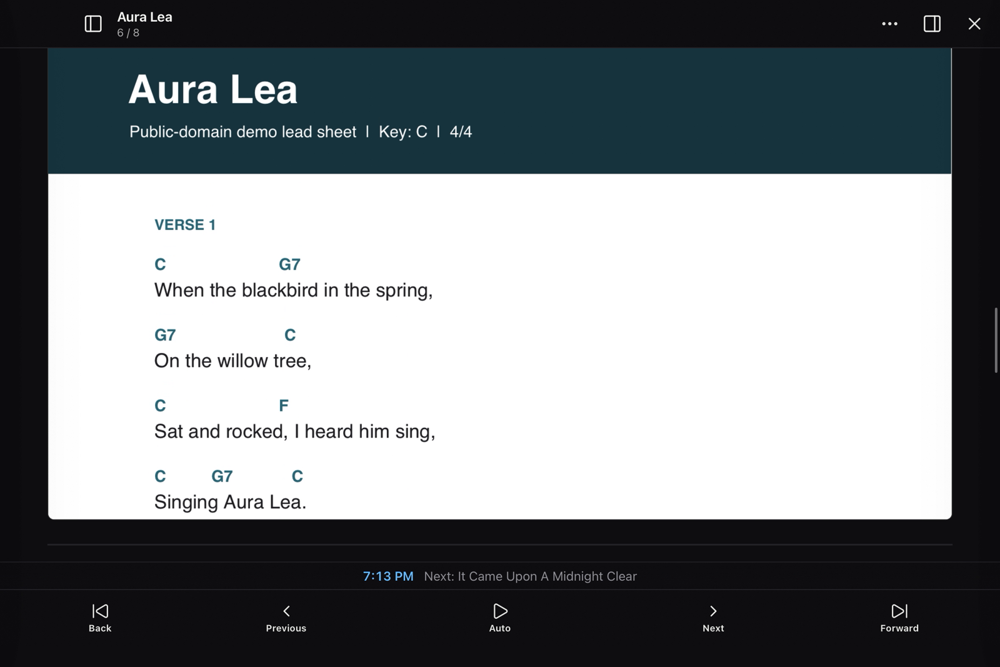
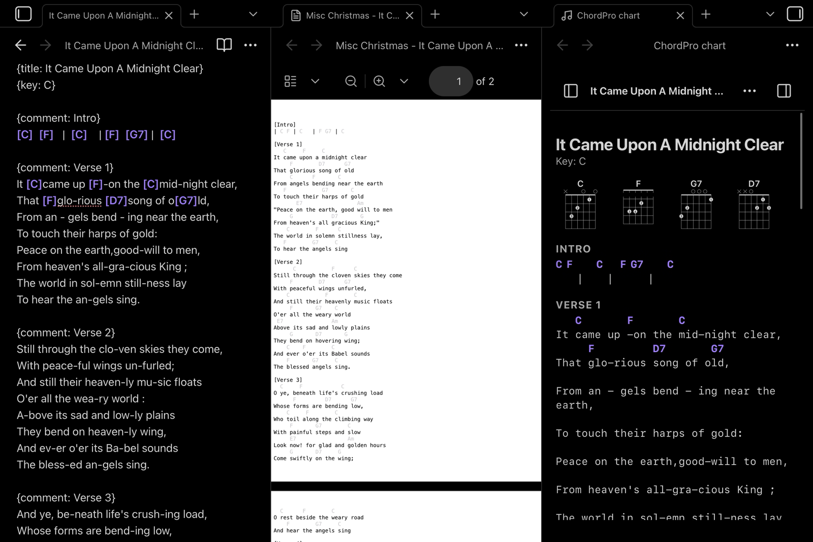

# Stage Binder

**Write the chart. Build the set. Perform the plan.**

Stage Binder is an Obsidian plugin for building ChordPro charts, organizing setlists and run sheets, transposing on the fly, and performing from a tablet or desktop. Songs remain ordinary Markdown or `.chordpro` files in your vault: no database, no cloud account, no lock-in.



[Get started](docs/getting-started.md) · [Download 1.0.0](https://github.com/IngloriousPSTR/stage-binder/releases/tag/1.0.0) · [Report an issue](https://github.com/IngloriousPSTR/stage-binder/issues)

## Why

Most music tools manage a list of songs. A service or show is more than a list of songs.

Stage Binder keeps the whole plan together: charts, the Form each song is actually played in, performance keys, clock times, assignments, readings and notes, PDFs, images, and the running order. When the set begins, the same files become a touch-friendly performance view.

Charts, setlists, and run sheets remain ordinary files in your Obsidian vault. They stay searchable, work offline, and remain yours if you stop using the plugin tomorrow.

Stage Binder was built first for a small church with a volunteer band and no room in the budget for another subscription. The same workflow also fits gigging musicians, bandleaders, and songwriters who need more than a folder of disconnected charts.

### Why ChordPro?

ChordPro is a plain-text format that puts chord names inline with lyrics using square brackets: `[G]Amazing grace, how [C]sweet`. It has been the standard for musician-readable chord charts since the 1990s, and for good reason.

**Transpose in seconds.** Because chords are symbolic text, not fixed images or formatted cells, Stage Binder can shift every chord in a song up or down by any interval instantly. No retyping, no copy errors, no reformatting. A guitarist who needs the song in Bb instead of G changes one setting and the entire chart updates.

**Capo-aware transposition.** Set a capo fret and the chart shows the open-position shapes you actually play, while the sounding key stays correct for the rest of the band. Pianists see concert pitch; guitarists see capo shapes. Same chart, same source file.

**Nashville Number System.** Toggle any chart to Nashville numbers (1, 4, 5, etc.) so session players and readers comfortable with that system can use the same song without a separate chart.

**Rich metadata, zero lock-in.** ChordPro directives like `{key}`, `{tempo}`, `{artist}`, `{ccli}`, and `{form}` travel with the song as plain text. Your music library is a folder of readable files you own forever.

### Why Obsidian?

Obsidian treats every note as a local file: Markdown, ChordPro, PDF, image. That makes it a natural home for a music library built on plain-text formats.

**Your songs are just files.** A `.chordpro` file in your vault is the same file you could open in any text editor, sync to any device, or check into version control. Obsidian adds structure on top without changing the file underneath.

**Link anything to anything.** Obsidian's `[[wikilink]]` syntax means a setlist is just a note with links to songs. A run sheet links to songs, PDFs, liturgy notes, and images. No import/export step, no separate database. Reorganize by dragging files; links update automatically.

**Metadata that works.** Obsidian's YAML properties (`key`, `artist`, `tempo`, `ccli`) and ChordPro directives both store song metadata as readable text. Use Obsidian's search, Dataview, or Bases to query your entire library: find every song in the key of E, list all songs by a specific artist, or pull a CCLI report across hundreds of songs in seconds.

**One vault, every device.** Sync your vault through iCloud, Obsidian Sync, or any file-sync tool. The same song library is on your laptop for rehearsal prep and your tablet on the music stand.

**Community ecosystem.** Stage Binder builds on Obsidian's plugin API and works alongside the tools you already use: Templates for new-song scaffolding, QuickAdd for rapid chord entry workflows, Dataview for smart setlist queries.

## Features

### Write charts fast

- Multiple ways to insert chords: hotkeys, the command palette, the Stage Binder toolbox, or type `[` in your note to trigger the chord insertion popup.
- Key-aware chord suggestions. The chord popup, toolbar, and palette all respect the song's `{key}` directive. If your song is in G, you see G, Am, Bm, C, D, Em first, not every chord in Western music.
- Chord diagrams on demand. Hover over any chord name to see a fingering diagram. Diagrams can also appear at the top of the chart or pinned in the toolbar.

### Define song form

Declare a song's structure with the `{form}` directive: `V1 C V2 C B C`. The performance view follows the form, so the band sees sections in performance order even if the source file only writes each section once.

### Preview and perform

- Live preview with transpose, Nashville numbers, lyrics-only display, multi-column layout, and adjustable text sizing.
- Fullscreen performance mode designed for stage use: touch-friendly navigation, autoscroll, page-turner keyboard support (AirTurn, PageFlip), MIDI pedal input, and light or dark themes.

### Setlists and run sheets

- Setlists are Markdown notes with Obsidian links in performance order. Assign a performance key to each song right in the setlist; the chart transposes automatically when you open it.
- Run sheets add structure for full services or shows: start times, section headings, durations, leader assignments, and links to songs, PDFs, liturgy notes, and images.

### Export and reporting

- Export transposed ChordPro files for sharing or printing.
- Generate printable set notes.
- Prepare CCLI usage reports from your setlist history.

## See it in action

### Write and arrange

Preview a chart while adjusting its key, Nashville numbers, lyrics, text size, columns, and autoscroll from one compact Tools panel.



Build the song's Form as the roadmap you will actually perform.



### Build the whole run sheet

Mix songs, Markdown notes, images, PDFs, clock times, roles, and durations in one running order.



### Perform from charts and PDFs

Use the same stage controls with transposable charts or fixed PDF material.



Keep a source PDF beside a ChordPro file while rebuilding it as a transposable, searchable chart.



## Install

After Stage Binder is accepted into the Obsidian Community directory:

1. Open **Settings → Community plugins → Browse**.
2. Search for **Stage Binder**.
3. Select **Install**, then **Enable**.

For prerelease or manual testing, download `main.js`, `manifest.json`, and `styles.css` from the latest GitHub release and place them in:

```text
<your-vault>/.obsidian/plugins/stage-binder/
```

Reload Obsidian, then enable Stage Binder under Community plugins.

Requires Obsidian 1.8.7 or later. Desktop and mobile are supported.

## Quick start

1. Run **New song** from the command palette.
2. Open the Stage Binder toolbox from the guitar ribbon icon.
3. Add section labels and chords, then choose **Preview**.
4. Create a Markdown note containing links to songs and run **Open setlist**.
5. Choose **Perform** when you are ready to use the set on stage.

The repository includes one small [public-domain demo set](examples/) that can be copied into a scratch vault. Stage Binder never creates demo files automatically.

For the complete first-use walkthrough, read [Getting started with Stage Binder](docs/getting-started.md).

## Song format

Songs can be `.chordpro` files or Markdown notes. Metadata can use ChordPro directives:

```chordpro
{title: Amazing Grace}
{artist: John Newton}
{key: G}
{form: V1 V2 V3 V4}

{comment: Verse 1}
Amazing [G]grace, how [C]sweet the [G]sound
That saved a wretch like [D]me
```

Markdown songs can keep the same values in YAML properties and place the chart in the note body or a fenced `chordpro` block.

## Setlists and run sheets

A setlist is a Markdown note containing links in performance order:

```markdown
# Saturday set

1. [[Songs/Amazing Grace.chordpro]] in G
2. [[PDF/Aura Lea.pdf]]
```

A run sheet may also contain a `start` property, headings, durations, and leaders:

```markdown
---
start: 7:30 PM
---

## Set one

- [[Songs/Amazing Grace.chordpro]] in G (4 min) @Band
- Changeover (2 min) @Stage
```

## Network use and privacy

Stage Binder does not include telemetry, analytics, advertising, accounts, payments, or automatic network requests.

The plugin reads files only from the current Obsidian vault. It writes or rewrites files only after an explicit user action, such as creating a song, committing a transpose, exporting a chart, or generating a report. A user may attach an external reference-audio URL to a song; Stage Binder displays that URL as a link and connects only when the user chooses to open it.

## Development

```bash
npm install
npm run lint
npm test
npm run build
```

To install a build in a scratch vault:

```bash
CHORDPRO_VAULT="/absolute/path/to/scratch-vault" npm run install:vault
```

Do not test development builds in a vault containing irreplaceable material.

## Security and copyright

Rendered chart HTML passes through Obsidian's sanitizer. The plugin does not include song libraries or licensed lyrics. Users are responsible for having permission to store, display, print, or share the music they add to their vault.

The files under `examples/` use public-domain works. Their provenance is documented in [examples/README.md](examples/README.md).

## License

Stage Binder is released under the [MIT License](LICENSE). Third-party notices are preserved in [THIRD_PARTY_LICENSES](THIRD_PARTY_LICENSES/README.md).
